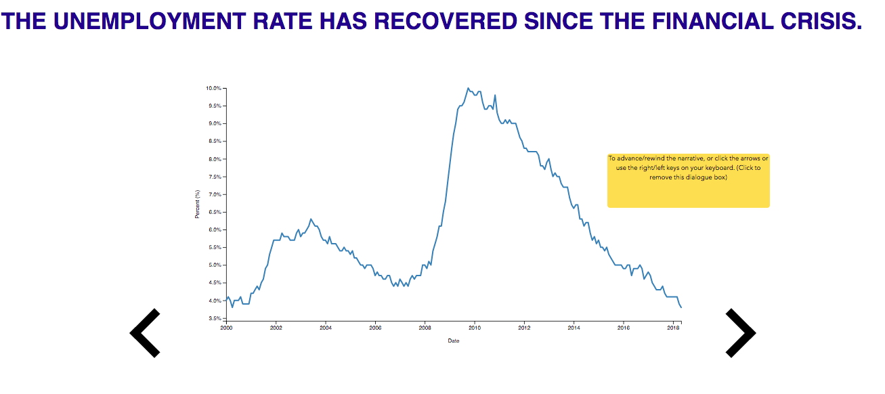

# Employment vignette

This repository contains code for an interactive web vignette on USA employment history. Basic layout as roughly as follows in screenshot below -- clickable slides with interactive visualizations and transitions based on user input. As tools, Javascript and D3.js are relied upon heavily to add the visualization and interactivity.

## To use:

1. `git clone https://github.com/wnowak10/employment.git`
2.  Download and launch [MAMP](https://www.mamp.info/en/).
3. At MAMP open, click 'Start Servers' > 'Open WebStart Page' > 'My Website' and then navigate to `employment/` or whatever you titled this cloned directory. From there, click on `docs/` which contains source code to run this vignette in your browser. The start page should look like the slide screenshotted above. 

## Code README:

- `data/`: contains `.csv` files referenced in chart creation.

- `index.html` - body HTML file, contains code for the 'script' of our HTML vignette.

- `js/` : A suite of JS libraries...to note, `draw.js` is a custom JS file with functions used to draw lines and add other visual effects.

- `map.css` : Stylesheet for this site. Annoyingly, we also have a `<style type="text/css">` block in our `index.html` code. I'm not a CSS expert, and the site formatting works improperly if I move the inline CSS all to `map.css`. TO DO: centralize and organize style sheets.

## Other Notes:

 
